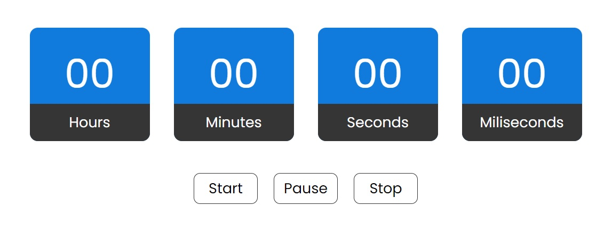

# Простой таймер
Данное приложение выполнено в образовательных целях, для повышения личных навыков и расширения портфолио.

## Дополнение
Приложение собрано через gulp, поэтому все документы минифицированы и записаны в inline стиле.

## Общий вид приложения

## Функционал

__Start__ - запускает таймер

__Stop__ - сбрасывает таймер

__Pause__ - ставит на паузу, при нажатии на __Start__ возобнавляет с того же места